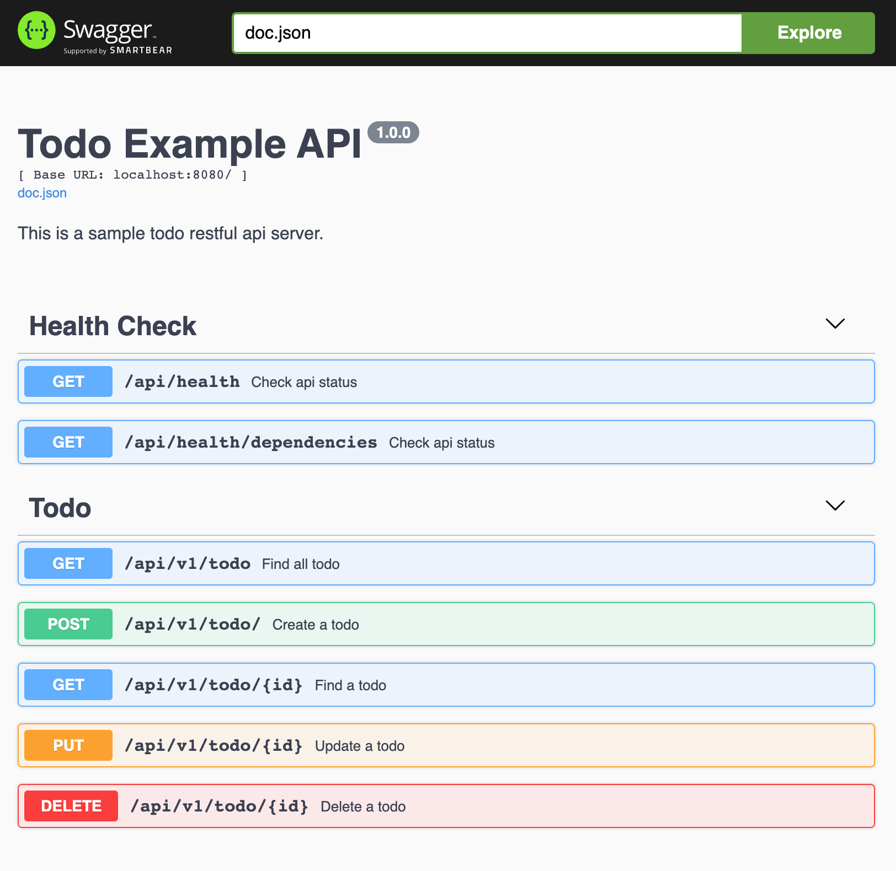

# Clean Architecture Todo REST API with Go

This repository is a sample go lang web project built according to Clean Architecture.  

## Build with
* Gin Web Framework
* Docker support
* Swagger UI support
* MongoDb support
* Wire (Dependency Injection) support 

### Layers and Dependencies


## API (HTTP Web Api Layer)
This layer is handling all HTTP requests messages on controllers. 
Routes and DTOs (Data Transfer Objects) are defined in this layer.

## CORE (Business Layer)
This layer consists of business rules which has domain models and use cases. 
There are mostly no external dependencies in this layer, no network connections, databases, etc. allowed.
Data is transmitted to this layer via repositories and clients.

## INFRA (Infrastructure Layer)
All external dependencies are defined in this layer. 
Connections with external data resources (api, database etc.) are made through this layer via clients and database providers.
We can add configuration processes and utilities here.

## Installation
 Open your terminal and clone this repository.
 
    git clone https://github.com/mecitsemerci/clean-go-todo-api.git

If docker is running, run docker compose up command in the folder.

    docker-compose up

Check the app is running on http://localhost:8080/swagger/index.html

 ## Swagger UI Preview
 
 
 
### Wire 

If you want to change something on controller, service or repository, don't forget generate wire_gen.go

Run command on your terminal

```
bash wire.sh
```

Check `wire_gen.go` file under `app/infra/wired`directory for differences. Don't change `wire_gen.go` file manually. If you want to learn wire usage check this repo.

https://github.com/google/wire
 
### Folder Structure
    
    .
    ├── Dockerfile
    ├── README.md
    ├── app
    │   ├── api
    │   │   ├── api.go
    │   │   ├── controller
    │   │   │   ├── health_controller.go
    │   │   │   ├── provider.go
    │   │   │   └── v1
    │   │   │       └── todo_controller.go
    │   │   ├── dto
    │   │   │   ├── error.go
    │   │   │   ├── health.go
    │   │   │   └── todo.go
    │   │   └── middleware
    │   ├── app.go
    │   ├── core
    │   │   ├── domain
    │   │   │   ├── identity.go
    │   │   │   └── todo
    │   │   │       ├── mock.go
    │   │   │       ├── todo.go
    │   │   │       └── todo_repository.go
    │   │   ├── provider.go
    │   │   └── services
    │   │       ├── mock.go
    │   │       ├── todo_service.go
    │   │       └── todo_service_test.go
    │   └── infra
    │       ├── adapter
    │       │   ├── mongodb
    │       │   │   ├── db_context.go
    │       │   │   ├── entities.go
    │       │   │   ├── object_id.go
    │       │   │   ├── todo_adapter.go
    │       │   │   └── todo_adapter_test.go
    │       │   └── provider.go
    │       ├── check
    │       │   └── check.go
    │       ├── config
    │       │   └── app.go
    │       ├── constants
    │       │   └── constants.go
    │       ├── datetime
    │       │   └── datetime.go
    │       ├── faker
    │       │   └── faker.go
    │       ├── httperrors
    │       │   └── errors.go
    │       ├── idgenerator
    │       │   └── idgenerator.go
    │       ├── infra.go
    │       ├── mock
    │       │   └── mock.go
    │       ├── validator
    │       │   └── validator.go
    │       └── wired
    │           ├── wire_gen.go
    │           └── wired.go
    ├── docker-compose.yml
    ├── go.mod
    ├── go.sum
    ├── main.go
    └── wire.sh