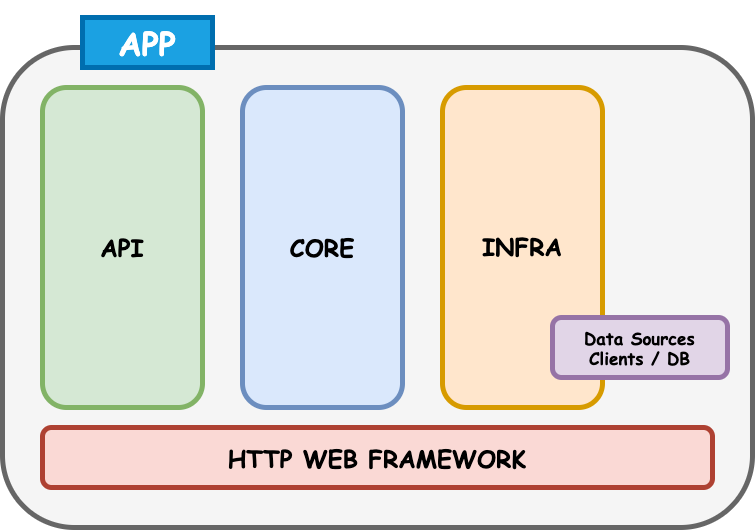

# Clean Todo Rest Api with Gin Web Framework

This repository is a sample go lang web project built according to Clean Architecture.  

## Build with
* Gin Web Framework
* Docker support
* :soon: MongoDb support
* :soon: Firebase support
* :soon: Swagger UI support

### Layers and Dependencies

## API (HTTP Web Api Layer)
This layer is handling all HTTP requests messages on controllers. 
Routes and DTOs (Data Transfer Objects) are defined in this layer.

## CORE (Business Layer)
This layer consists of business rules which has domain models and use cases. 
There are mostly no external dependencies in this layer, no network connections, databases, etc. allowed.
Data is transmitted to this layer via repositories and clients.

## INFRA (Infrastructure Layer)
All external dependencies are defined in this layer. 
Connections with external data resources (api, database etc.) are made through this layer via clients and database providers.
We can add configuration processes and utilities here.

## Installation
 Open your terminal and clone this repository.
 
    git clone https://github.com/mecitsemerci/clean-go-todo-api.git

If docker is running, run docker compose up command in the folder.

    docker-compose up

Check the app is running on http://localhost:8080

 ## Sample Requests
 
 ### GET ALL TODO
 
 Request
 
     GET /api/v1/todo HTTP/1.1
     Host: localhost:8080
 

 Response

    [
        {
            "id": "2d554d6a-d908-4de8-929e-e9c4d487c6a0",
            "title": "Todo1",
            "is_done": false,
            "created_at": "2020-07-24T21:06:31.726236Z",
            "updated_at": "2020-07-24T21:06:31.726236Z"
        },
        {
            "id": "6ba7b811-9dad-11d1-80b4-00c04fd430c8",
            "title": "Todo2",
            "is_done": true,
            "created_at": "2020-07-24T21:06:31.726236Z",
            "updated_at": "2020-07-24T21:06:31.726236Z"
        }
    ]

### GET TODO

Request

    GET /api/v1/todo/2d554d6a-d908-4de8-929e-e9c4d487c6a0 HTTP/1.1
    Host: localhost:8080

Response

    {
        "id": "2d554d6a-d908-4de8-929e-e9c4d487c6a0",
        "title": "Todo1",
        "is_done": false,
        "created_at": "2020-07-24T21:06:31.726236Z",
        "updated_at": "2020-07-24T21:06:31.726236Z"
    }

### POST TODO

Request

    POST /api/v1/todo/ HTTP/1.1
    Host: localhost:8080
    Content-Type: application/json
    
    {
        "title": "Shopping"
    }

Response

    {
        "todo_id": "fb067648-fd4f-41d6-8255-4d072907dc7b"
    }

### PUT TODO

Request

    PUT /api/v1/todo/2d554d6a-d908-4de8-929e-e9c4d487c6a0 HTTP/1.1
    Host: localhost:8080
    Content-Type: application/json
    
    {
        "title": "Shopping",
        "is_done": false
    }

Response

    {
        "result": true
    }

### DELETE TODO

Request

    DELETE /api/v1/todo/2d554d6a-d908-4de8-929e-e9c4d487c6a0 HTTP/1.1
    Host: localhost:8080

Response

    {
        "result": true
    }

## HEALTH CHECK

Request

    GET /api/health HTTP/1.1
    Host: localhost:8080

Response

    {
        "status": "healthy"
    }
