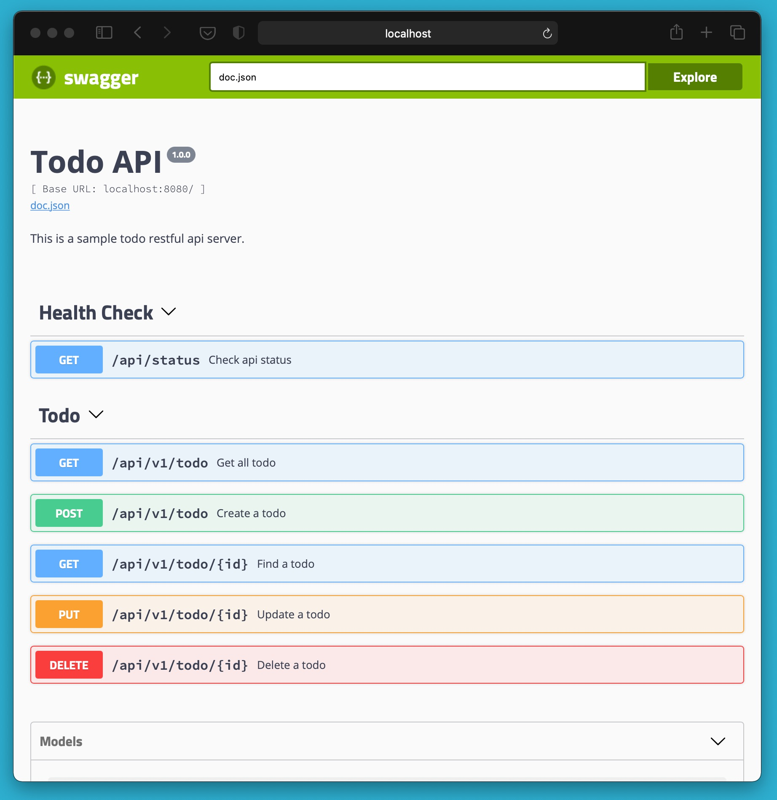

# Go + Angular Project Template

This repository is a todo sample go and angular web project built according to Clean Architecture.  

## Technologies
* Go Web Framework (gin-gonic)
* Containerize (Docker)
* Swagger (swaggo)
* Database
    * Mongodb (default)
    * Redis (soon)
* Dependency Injection (wire by google)
* Unit/Integration Tests (testify)
* Tracing (opentracing)
* WebUI (Angular 11)

### Web UI Preview

### Open API Doc Preview

## Layers and Dependencies

### `cmd` (application run)
Main application executive folder. Don't put a lot of code in the application directory.
The directory name for each application should match the name of the executable you want to have (e.g., /cmd/myapp).
It's common to have a small main function that imports and invokes the code from the /internal and /pkg directories and nothing else.

### `internal` (application codes)
Private application and library code. This is the code you don't want others importing in their applications or libraries.
* **core** includes application core files (domain objects, interfaces). It has no dependencies on another layer. 
* **pkg** includes external dependencies files and implementation of core interfaces.

### `test` (integration tests)
Application integration test folder.

### `web` (web ui)
Web application specific components: static web assets, server side templates and SPAs.

### `docs` (openapi docs)
open api (swagger) docs files. Swaggo generates automatically. 

    swag init -g ./cmd/api/main.go -o ./docs

### Usage

Open your terminal and clone the repository

    git clone https://github.com/mecitsemerci/go-todo-app.git

If docker is running, run docker compose up command in the project folder.

    docker-compose up

Application | URL
------------ | -------------
Web UI | http://localhost:5000
Swagger UI | http://localhost:8080/swagger/index.html
Jaeger UI | http://localhost:16686/